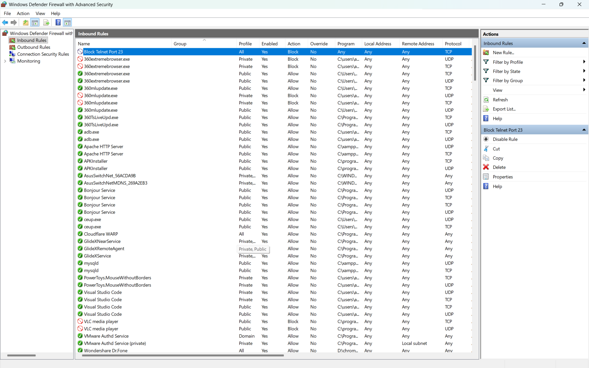
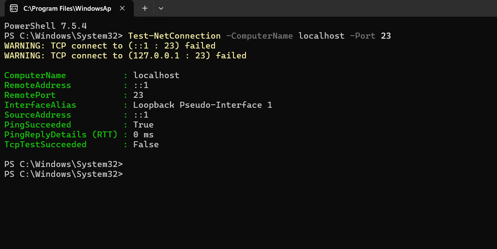

# Cybersecurity-Internship-Task-4
Submission for Task 4 of the Elevate Labs Cyber Security Internship: Firewall Setup and Configuration.

# Task 4: Setup and Use a Firewall

**Internship Task Report**

---

## 1. Objective

The objective of this task was to configure and test a basic firewall rule on a Windows system. The goal was to block all inbound traffic on a specific port (Port 23, Telnet) and verify that the block was successful. 

---

## 2. Tools Used

* **Windows Defender Firewall with Advanced Security** 
* **PowerShell** (for connection testing)

---

## 3. Procedure: How the Task Was Completed

Here are the exact steps taken to configure and test the firewall rule:

1.  **Opening the Firewall:** I opened the "Windows Defender Firewall with Advanced Security" application.
2.  **Creating a New Rule:** I selected "Inbound Rules" and then clicked "New Rule..." from the Actions panel.
3.  **Rule Configuration:** I configured the new rule as follows:
    * **Rule Type:** Port
    * **Protocol and Ports:** TCP, Specific local ports: `23` 
    * **Action:** Block the connection
    * **Profile:** All profiles (Domain, Private, Public) were selected.
    * **Name:** The rule was named "Block Telnet Port 23".
4.  **Testing the Rule:** To verify the rule was working, I opened PowerShell and ran the command `Test-NetConnection -ComputerName localhost -Port 23`. 
5.  **Verification:** The test result confirmed `TcpTestSucceeded: False`, which proves that the firewall is now actively blocking all incoming connections on port 23.

---

## 4. Deliverables / Results

The following screenshots serve as deliverables for this task.

### Screenshot 1: Firewall Rule Applied
This image shows the "Block Telnet Port 23" rule successfully created and enabled in the Windows Firewall "Inbound Rules" list.

### Screenshot 2: Connection Test Failure
This image shows the PowerShell test result. The `TcpTestSucceeded: False` line confirms that the connection was blocked by the new firewall rule.

---

## 5. Summary: How the Firewall Filtered Traffic

In this task, the firewall was configured to filter traffic based on a specific **port number**. I created a rule that instructed the firewall to inspect all **inbound** network packets. If any packet was destined for **TCP port 23**, the firewall's "Block" action was triggered, and the packet was dropped, preventing the connection. This demonstrates basic packet filtering and access control. 
